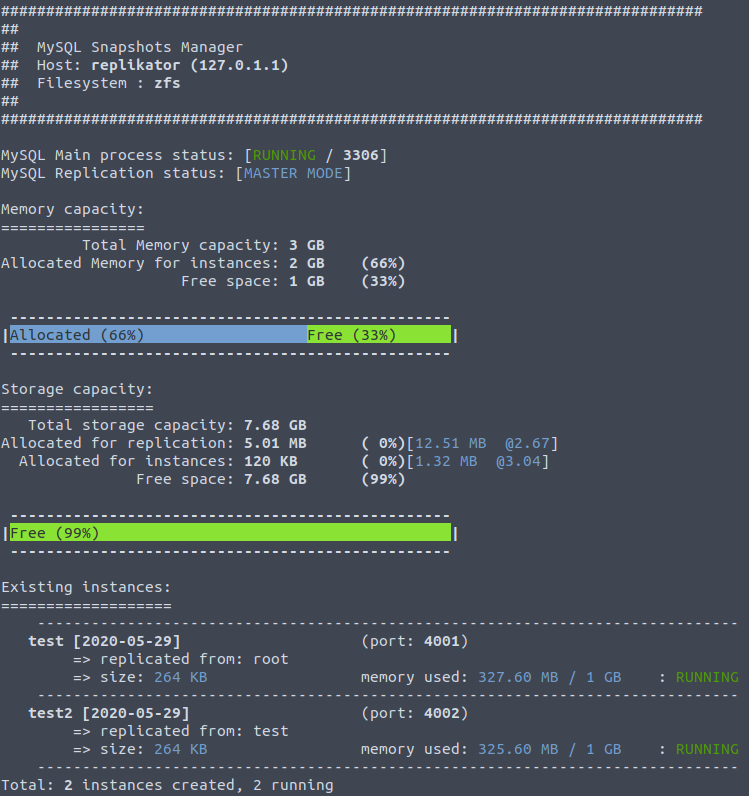

# Examples

## Create/Start/Stop/Delete a replica

```bash
# create a replica called "test" with default settings and random custom port
replikator-ctl --create test

# stop it
replikator-ctl --stop test

# start it
replikator-ctl --start test

# delete it
replikator-ctl --delete test
```

## Replica with custom settings

```bash
# create a replica called "test" with 8GB memory and running on port 4444
replikator-ctl --create test:8:4444
```

## Backup replicas

```bash
# create a backup replica
replikator-ctl --backup

# list all backup replicas
replikator-ctl --list-backups
```

## Replica from replica

```bash
# first, create a normal replica
replikator-ctl --create test

# then create a replica from this previous replica
replikator-ctl --create test2 --from-replica test
```

## JSON Output

By default, `replikator-ctl` will output on STDOUT with something like this :



By the way, it is also possible to output as JSON for CI/CD like process.

```bash
replikator-ctl -l -o json
```

Will output something like this :

```json
{
    "DatabaseGlobalState": {
        "DatabaseInstanceState": [
            {
                "DatabaseProperties": {
                    "iPort": 4001,
                    "sIP": "127.0.1.1",
                    "sInstanceId": "test",
                    "sOrigin": "root"
                },
                "aFromIpPortRedirects": [],
                "dCreationDate": "1590773754",
                "eState": "RUNNING",
                "sMemAllocated": "1073741824",
                "sMemUsed": "343519232",
                "sMetas": {},
                "sSizeTotal": "270336"
            },
            {
                "DatabaseProperties": {
                    "iPort": 4002,
                    "sIP": "127.0.1.1",
                    "sInstanceId": "test2",
                    "sOrigin": "test"
                },
                "aFromIpPortRedirects": [],
                "dCreationDate": "1590773761",
                "eState": "RUNNING",
                "sMemAllocated": "1073741824",
                "sMemUsed": "341422080",
                "sMetas": {},
                "sSizeTotal": "270336"
            }
        ],
        "eBaseProcessState": "RUNNING",
        "eReplicationState": "MASTER MODE",
        "iReplicationLag": "n/a",
        "iReplicationPort": 3306,
        "sAllocatedForDb": "5263360",
        "sAllocatedForInstances": "122880",
        "sAllocatedForInstancesCompressRatio": "3.04",
        "sAllocatedForInstancesLogical": "logicalusedspace",
        "sAllocatedMemForInstances": "2147483648",
        "sDbDataCompressRatio": "2.67",
        "sDbDataLogicalUsed": "13121536",
        "sDbDataUsed": "5263360",
        "sFqdn": "replikator",
        "sFree": "8249896960",
        "sFreeMem": "1073741824",
        "sFs": "zfs",
        "sIp": "127.0.1.1",
        "sPercentAllocatedForDb": "0",
        "sPercentAllocatedForInstances": "0",
        "sPercentAllocatedMemForInstances": "66",
        "sPercentFree": "99",
        "sPercentFreeMem": "33",
        "sTotalMemCapacity": "3221225472",
        "sTotalStorageCapacity": "8256487424"
    }
}
```