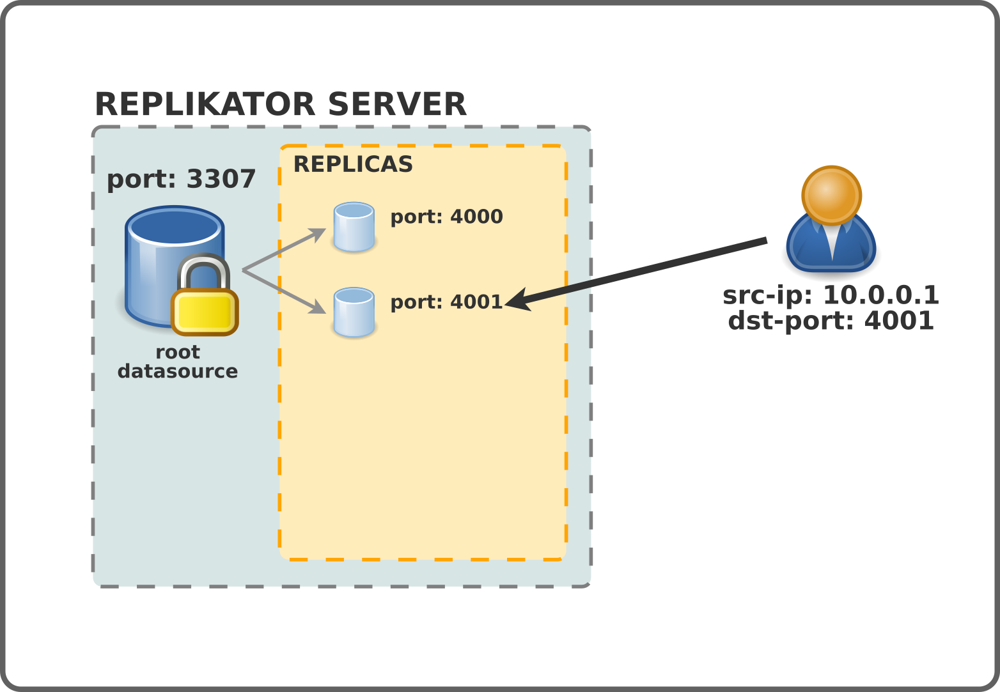
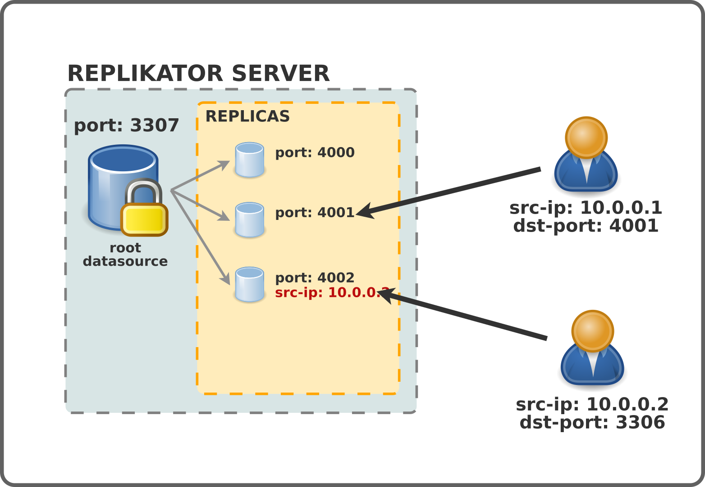
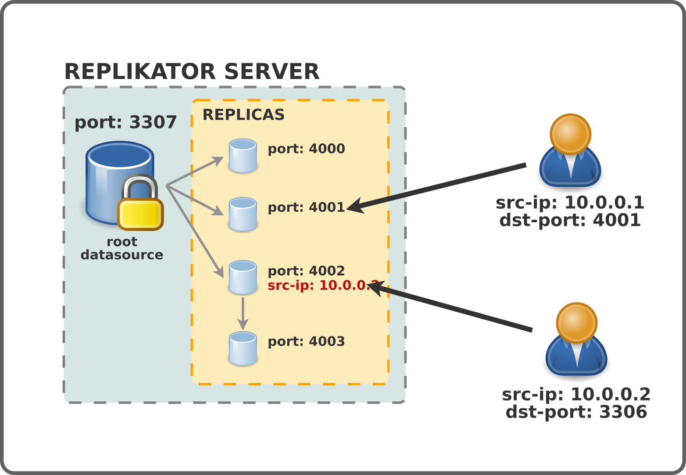

# Principles

A Replikator is a standalone MySQL/MariaDB server (bare metal or virtual machine) with a dedicated ZFS local storage and running the `replikator-ctl` script.
This script automates the creation of new MySQL instance on a dedicated port based on a snapshot of the main MySQL process called a "replica".

Why would I need it ?

## Basic usage

In this simple use case, the MySQL server is standalone and any end user can instantiate a copy of this main database in a matter of seconds with no downtime on the source database, whatever its size.
This can be useful for developers needing their own copy of a development database for their own usage.
Each copy runs its own process on a dedicated port.

Sometimes, your application can't use a dedicated port and can only use the default MySQL port (3306), in this case, you can use a "port redirection from source IP" configuration so that incoming connections from source IP X.X.X.X for port 3306 are automaticaly forwarded to your replica on its custom port.

## Advanced usage

In some cases, you need to modify the database each time you're creating a new copy.
This might be for different reasons such as anonimizing data.
For that purpose, `replikator-ctl` has a `--exec` switch which let's you run a script when a new replica is spawned.
Sometimes, this process can be very long and it can be a better option to create replicas from an already modified replica, that way, the long process is done only once and new replicas are spawned instantly.

## SLAVE mode

Having a standalone database that you can instant copy is already pretty cool but what about having a complete instant copy of your production database to test you're new features with real data in a "production like" environment ?
Well, this is the whole purpose of the SLAVE mode.
In that case, your Replikator base process is configured as a replication slave of an external database.
That way, your source data are always identical to your external database and your replicas are instant copies of your external database (with or without modifications depending on your needs).

Of course, you can use every advanced features in this mode too (port redirection, replica from replica, post instance script, ...)

