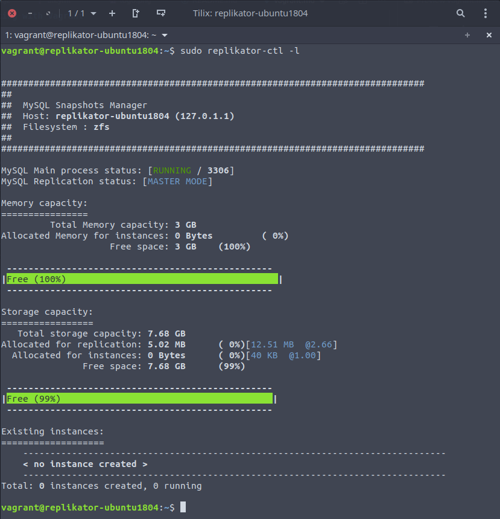

# Testing with Vagrant

If you just want to try or if you want to do some improvements to the script, there is a Vagrant setup which creates a small Replikator VM configured in MASTER mode (a standalone MySQL server).
The architecture is this :
- one VM with 2 vCPUs, 4GB RAM
- 1 "system" disk (/dev/sda, operating system + applications)
- 1 8GB "data" disk (/dev/sdb, dedicated to ZFS)
- 1 private network interface with IP 10.2.3.4

A zpool called "myzpool" is created over /dev/sdb.
A subvolume called "myzpool/mysql-data/mysql" is mounted directly into "/var/lib/mysql" and stores the base process data.
The base process runs on port 3306 (default MySQL port).
You can connect the MySQL server instance and the replicas from your local workstation through the private network IP (eg. `mysql -u testuser -p -h 10.2.3.4 -P 3306`)

To start the box :
- clone the repo
- go to the root of the cloned repo folder
- start the box, first start will take some time to complete : `vagrant up`
- get into the box : `vagrant ssh`
- `replikator-ctl` needs privileges, use sudo, as an example, type `sudo replikator-ctl --list` you should get something similar to this 

